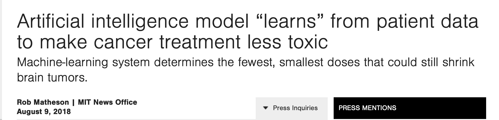
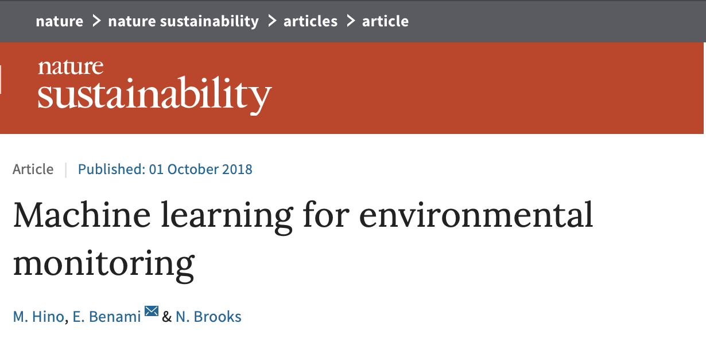
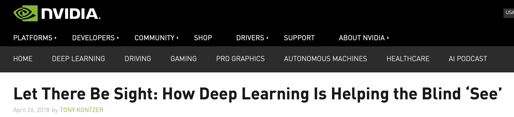

# Lyrics Sentiment Analysis
Starting my Computer Engineering bachelor's in 2015, I learned about Machine Learning in the best moment possible. The amount of problems of considerably high complexity anyone can solve, using publicly available tools and data, amazes me. Such interest, together with a motivation to bring solutions to other motivated me to enter the Apple Developer Academy at Instituto Eldorado.

These interests and decisions brought me to develop this playground.

-------------------

## New Oportunities

Recent state-of-the-art machine learning models are unveiling a whole new world of possibilities, just like some recent news reveal:

[Source](http://news.mit.edu/2018/artificial-intelligence-model-learns-patient-data-cancer-treatment-less-toxic-0810)

[Source]( https://www.nature.com/articles/s41893-018-0142-9)

[Source](https://blogs.nvidia.com/blog/2018/04/26/deep-learning-app-seeing-ai-app/)

And going beyond cancer treatment improvements, better environmental law enforcement (and natural resources management) or even helping blind people "see", this trend points toward a future of overall inclusion, where technology aids us in our daily tasks or challenges of any kind.

With this given motivation, I used Apple's CoreML library to build a Machine Learning model in a playground environment. My model classifies song lyrics as either Happy or Sad, using a training set of 1000 songs inspired by [another project](https://github.com/rasbt/musicmood) [2] based on the [Million Song Dataset](https://labrosa.ee.columbia.edu/millionsong/)[1]. A model such as this one could aid people with difficulties regarding emotion comprehension within a textual context and used to educate or orient them to understand more about the emotions of those around.

-----

### References and credits:
1. Thierry Bertin-Mahieux, Daniel P.W. Ellis, Brian Whitman, and Paul Lamere.
The Million Song Dataset. In Proceedings of the 12th International Society
for Music Information Retrieval Conference (ISMIR 2011), 2011
2. Playground and model by: Ignácio Espinoso Ribeiro
3. Happy Icon by Freepik, from Flaticon, licensed by Creative Commmons 3.0
4. Sad icon by Smashicons, from Flaticon, licensed by Creative Commmons 3.0
I do not own any right or credit of the sample lyrics or the ones used in the model training.
